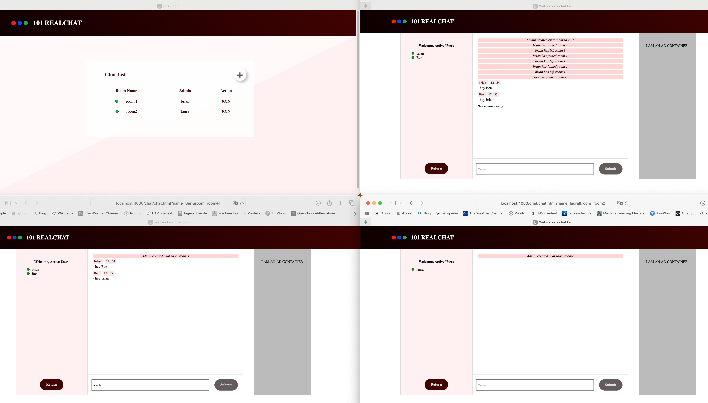

# 101 RealChat — Real-Time Chat Room

A real-time chat application where users can create and join chat rooms, send messages, and see live typing indicators.

| Layer    | Technology                     |
|----------|--------------------------------|
| Frontend | Vanilla JavaScript, HTML, CSS  |
| Backend  | Node.js, Express               |
| Realtime | Socket.IO                      |
| Database | MongoDB, Mongoose              |
| Security | Helmet                         |

🔗 [Live Demo](https://real-time-chat-room-eerb.onrender.com)



---

## Features

- Create and join chat rooms
- Real-time messaging with Socket.IO
- Message history (last 50 messages loaded on join)
- Live typing indicators
- Active user list per room
- Join/leave notifications
- Duplicate username prevention per room

## Prerequisites

- [Node.js](https://nodejs.org/) (v12 or higher)
- [MongoDB Community Edition](https://docs.mongodb.com/manual/installation/) — or a [MongoDB Atlas](https://www.mongodb.com/cloud/atlas) account

## Setup

```bash
npm install
cp .env.example .env
```

### Local MongoDB

```bash
# macOS/Linux
mongod
```

Leave `MONGODB_URI` as the default in `.env`.

### MongoDB Atlas (Cloud)

1. Create a free account at [MongoDB Atlas](https://www.mongodb.com/cloud/atlas)
2. Create a cluster and get your connection string
3. Set it in `.env`:

```
MONGODB_URI=mongodb+srv://<user>:<password>@cluster.mongodb.net/listOfUsers
```

## Running

```bash
npm start        # production
npm run dev      # development (auto-reload)
```

Open `http://localhost:4000`.

## Project Structure

```
.
├── public/               # Static client-side files
├── server/
│   ├── index.js          # Main server + socket events
│   ├── dbconnection.js   # MongoDB connection
│   └── utils/users.js    # In-memory user management
├── models/
│   ├── list.js           # Schema for room/user tracking
│   └── message.js        # Schema for message persistence
└── package.json
```
